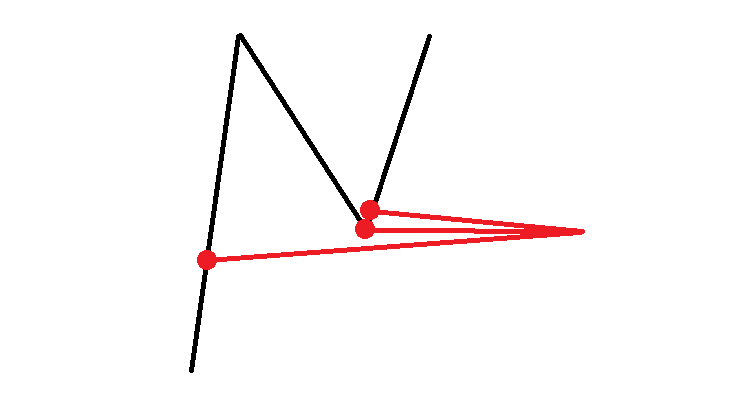

# 計算街區內多個點的可見多邊形的覆蓋面積

可見多邊形是在平面中可以透過直線視線看到的區域。本專案用於分析街區不同位置的可見範圍，並計算多個點的可見多邊形聯集面積。

## 可見多邊形計算原理

1. **透過骨架進行BFS搜尋在骨架上可見的所有端點**：這個方法就不用對所有點進行可見性判斷，可以增加更大更複雜圖形中計算的效率
2. **對所有可見頂點投射左右小角度共三條線交會在圖形上**：這樣可以簡單的判斷轉角的頂點，繪製頂點後的投影點的近似結果

3. **繪製可見多邊形**：殺掉近似點後繪製多邊形

## 執行環境設置

### 系統需求

- Python >= 3.8
- Conda（推薦使用 Miniconda 或 Anaconda）

### 建立 Conda 環境

使用 conda-forge

```bash
# 建立新的 conda 環境
conda create -n vistPoly python=3.10

# 激活環境
conda activate vistPloy

# 使用 conda-forge 安裝依賴
conda install -c conda-forge compas compas_cgal compas_viewer shapely numpy
```

## 依賴項列表

### 核心依賴

| 套件名稱 | 版本 | 用途 |
|---------|------|------|
| **COMPAS** | >=1.0 | 計算設計與建築幾何處理框架 |
| **COMPAS CGAL** | >=0.2.0 | CGAL 幾何算法的 Python 綁定 |
| **COMPAS Viewer** | >=0.1.0 | 3D 幾何可視化工具 |
| **Shapely** | >=2.0 | 平面幾何運算庫 |
| **NumPy** | >=1.20 | 數值計算與陣列操作 |

### COMPAS 子模組

| 模組 | 用途 |
|------|------|
| compas.datastructures | Mesh、Network 等數據結構 |
| compas.geometry | Point、Line、Polygon 等幾何基本單位 |
| compas_cgal.straight_skeleton_2 | 直線骨架（Straight Skeleton）計算 |
| compas_viewer | 3D 場景可視化 |
| compas_viewer.scene | 場景管理（Tag 等標籤工具） |

### Shapely 子模組

| 模組 | 用途 |
|------|------|
| shapely.geometry | Polygon、LineString、Point 等 2D 幾何 |
| shapely.ops | unary_union 等幾何運算函數 |

### Python 標準庫

| 模組 | 用途 |
|------|------|
| pathlib | 跨平台路徑操作 |
| collections | deque 等集合資料結構 |

### 內部模組

| 模組名稱 | 所屬檔案 | 用途 |
|---------|--------|------|
| isovist | isovist.py | 可見多邊形計算 |
| buildSkeleton | buildSkeleton.py | 直線骨架建立與邊界提取 |
| booleanVist | booleanVist.py | 多點可見多邊形聯集運算 |

## 程式架構

### 主要檔案

| 檔案名稱 | 作用 |
| --------- | ------|
| Roads.stl | 儲存平面網格的檔案 |
| buildSkeleton.py | 從 STL 檔案中建立 Straight Skeleton |
| isovist.py | 利用骨架計算可見多邊形 |
| booleanVist.py | 計算多個點的聯集可見多邊形 |

### 次要檔案（可視化與測試）

| 檔案名稱 | 作用 |
| --------- | ------ |
| view-isovist-from-point.py | 將可見多邊形可視化 |
| viewBoolean.py | 將多個點的可見多邊形聯集可視化 |
| viewRandomDotCoverage.py | 測試多個點同時計算可見多邊形 |
| Block.stl | 在可視化中標示巷弄外街區範圍 |

## 執行程式

### 激活環境

```bash
# 激活 conda 環境
conda activate dccg
```

### 運行各程式

```bash
# 可視化可見多邊形
python view-isovist-from-point.py

# 運行布林聯集計算
python viewBoolean.py

# 運行隨機點覆蓋分析
python viewRandomDotCoverage.py

# 建立骨架
python buildSkeleton.py
```

## 主要函數說明

### buildSkeleton.py

- `find_boundary_edges(mesh)` - 提取 Mesh 的邊界邊
- `find_boundary_lines(mesh)` - 提取邊界線
- `find_boundary_vertices(mesh)` - 提取邊界頂點
- `mesh_boundaries_to_polygons(mesh)` - 轉換邊界為 Shapely Polygon
- `costume_straight_skeleton(mesh)` - 計算直線骨架

### isovist.py

- `compute_isovist_compas(mesh, origin, n_rays, max_dist)` - 使用射線投射計算可見多邊形
- `is_point_inside_polygon(point, polygon, holes)` - 判斷點是否在多邊形內
- 支援多邊形與孔洞的可見性分析

### booleanVist.py

- `compute_visibility_union(points, skeleton, boundary_polygon, boundary_lines)` - 計算多個點可見多邊形的聯集
- 支援面積計算與統計分析

### viewRandomDotCoverage.py

- 隨機生成點位並計算覆蓋面積
- 分析最佳觀察點位置

## 故障排除

### 常見問題

1. **COMPAS CGAL 安裝失敗**
   ```bash
   conda install -c conda-forge compas_cgal
   ```
   或使用預編譯輪子：
   ```bash
   pip install compas_cgal
   ```

2. **Viewer 無法啟動**
   - 確保使用支援 OpenGL 的環境
   - Windows 用戶可能需要更新顯卡驅動
   - 嘗試重新安裝：`pip install --upgrade compas_viewer`

3. **STL 檔案找不到**
   - 確保 Roads.stl 與 Block.stl 位於 Practices 目錄中
   - 檢查檔案路徑是否正確

4. **Python 版本不相容**
   - 確保使用 Python 3.8 或更新版本
   - 推薦使用 Python 3.10 或 3.11

## 相關資源

- [COMPAS 官方文檔](https://compas.dev)
- [COMPAS CGAL 文檔](https://compas.dev/latest/api/compas_cgal.html)
- [COMPAS Viewer 文檔](https://github.com/compas-dev/compas_viewer)
- [Shapely 文檔](https://shapely.readthedocs.io/)
- [NumPy 文檔](https://numpy.org/doc/)# Visibility-Polygon
# Visibility-Polygon
